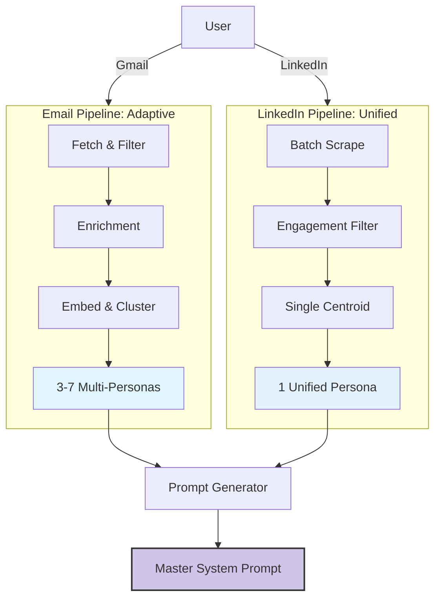

# Writing Style Clone (v2.1)

> **Turn your digital footprint into a production-grade AI Persona.**

Unlike generic prompt generators, this system uses mathematical clustering (HDBSCAN) and vector embeddings (all-MiniLM-L6-v2) to discover your *actual* writing patterns, not just your vibes.

## 🏗️ Architecture: The Dual Pipeline

We enforce a strict separation between private and public personas.



### 1. Email Pipeline (Private & Adaptive)
- **Logic:** Context-Aware. You write differently to your boss vs. your team.
- **Tech:** HDBSCAN Clustering discovers distinct modes (Formal, Casual, Brief).
- **Output:** Multiple personas triggered by recipient context.

### 2. LinkedIn Pipeline (Public & Unified)
- **Logic:** Brand-Consistent. You maintain one professional voice for the public.
- **Tech:** Centroid analysis enforces consistency across all posts.
- **Output:** One robust "Thought Leader" profile.

---

## 🚀 Quick Start (Token-Efficient Workflow)

### Step 1: LinkedIn Processing (Cost: 5 tool calls)
This uses our optimization layer to fetch, filter, and process comments in one pass.

```bash
# 1. auto-fetch and process 20 posts
python3 skill/scripts/fetch_linkedin_complete.py --profile <your_username> --limit 20

# 2. generate the unified persona
python3 skill/scripts/cluster_linkedin.py
```

### Step 2: Email Processing (Cost: varies by volume)
Connects to Gmail to build your adaptive personas.

```bash
# 1. fetch 200 emails with 15% holdout for validation
python3 skill/scripts/fetch_emails.py --count 200 --holdout 0.15

# 2. run the full analysis pipeline
python3 skill/scripts/filter_emails.py
python3 skill/scripts/enrich_emails.py
python3 skill/scripts/embed_emails.py
python3 skill/scripts/cluster_emails.py
```

### Step 3: Generate Master Prompt
Combines everything into your final copy-paste artifact.

```bash
python3 skill/scripts/generate_system_prompt.py
```

**Output:** `prompts/writing_assistant.md`

---

## 📦 Artifacts & Schema

The system produces rich JSON profiles that include:
- **Tone Vectors:** 1-10 scales for Formality, Warmth, Authority, Directness.
- **Structural DNA:** Hooks, closers, and sentence variance patterns.
- **Formatting Rules:** Usage of bullets, bolding, and emojis.
- **Anti-Patterns:** Context-specific "Never do this" rules.

See `skill/references/output_template.md` for the full schema definition.

## 🛡️ Privacy & Security
- **Local Execution:** All analysis happens locally. No data leaves your machine.
- **Validation Loop:** The system tests itself against a holdout set to prove accuracy before generating the prompt.

## 🛠️ Developer Notes
- **Dependencies:** `sentence-transformers`, `numpy`, `scikit-learn`
- **Efficiency:** The batch processing scripts (`process_linkedin_batch.py`) reduce API calls by ~90% vs sequential processing.
