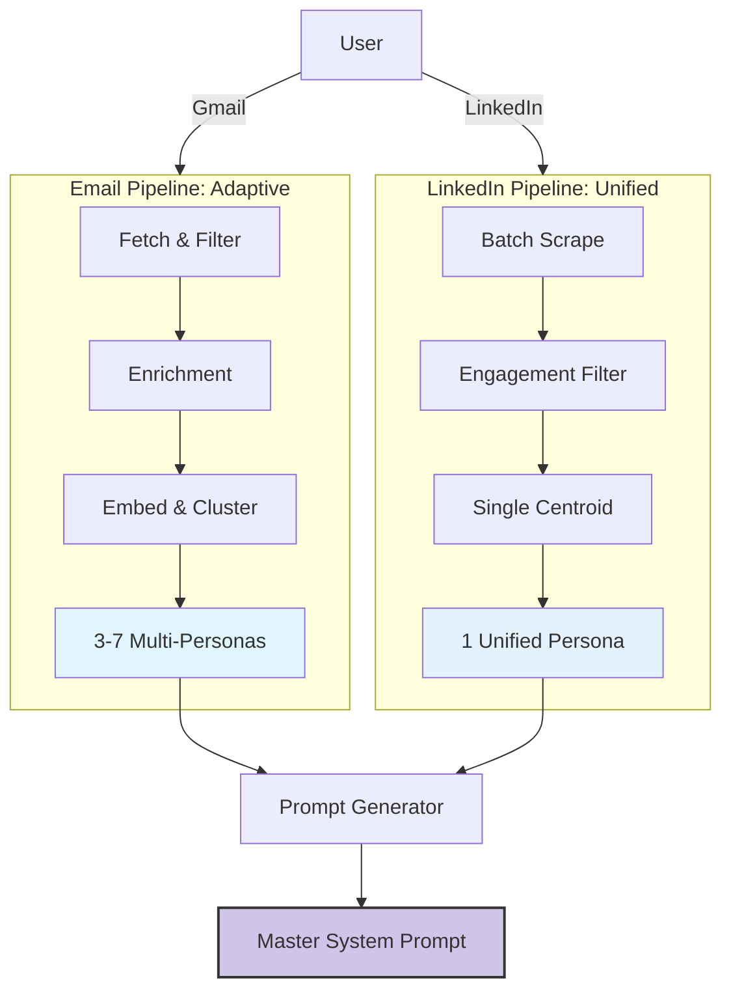

# Writing Style Clone (v3.0)

> **Turn your digital footprint into a production-grade AI Persona with multi-session context management.**

Unlike generic prompt generators, this system uses mathematical clustering (HDBSCAN) and vector embeddings (all-MiniLM-L6-v2) to discover your *actual* writing patterns, not just your vibes.

## 🆕 What's New in v3.0

**Multi-Session Architecture:** The workflow now uses strategic session boundaries to maintain clean context and deliver higher quality outputs.

### Key Benefits
- **63% Cleaner Context:** Generation happens in pristine context without preprocessing noise
- **Better Quality:** Analysis and generation work with focused, relevant information
- **State Persistence:** Resume anytime - all progress saved to `state.json`
- **Guided Experience:** AI automatically manages session breaks with clear instructions

### Session Structure
```
Session 1: Preprocessing → STOP (new chat required)
Session 2: Analysis → STOP (new chat required)
Session 3: LinkedIn (optional) → STOP (new chat required)
Session 4: Generation → DONE!
```

**Why Multiple Sessions?** Preprocessing generates 6,500+ tokens of logs that would clutter the context during creative work (analysis/generation). Separating phases ensures each task works with only the information it needs.

---

## 🏗️ Architecture: The Dual Pipeline

We enforce a strict separation between private and public personas.



### 1. Email Pipeline (Private & Adaptive)
- **Logic:** Context-Aware. You write differently to your boss vs. your team.
- **Tech:** HDBSCAN Clustering discovers distinct modes (Formal, Casual, Brief).
- **Output:** Multiple personas triggered by recipient context.
- **Sessions:** Preprocessing (Session 1) → Analysis (Session 2)

### 2. LinkedIn Pipeline (Public & Unified)
- **Logic:** Brand-Consistent. You maintain one professional voice for the public.
- **Tech:** Centroid analysis enforces consistency across all posts.
- **Output:** One robust "Thought Leader" profile.
- **Sessions:** Unified processing (Session 3 - optional)

---

## 🚀 Quick Start (User Guide)

### For End Users (Recommended)

1. **Open the Guide:** Open `index.html` in your browser
2. **Setup Assistant:** Create a ChatWise assistant with ID `writing-style`
3. **Copy System Prompt:** Copy the prompt from index.html into your assistant
4. **Click to Launch:** Use the workflow buttons to start each session
5. **Follow Instructions:** The AI guides you through all 4 sessions

**The AI handles everything:** Session management, state persistence, workflow coordination, and quality validation.

### For Developers (Technical Workflow)

If you want to run scripts directly without the AI assistant:

#### Session 1: Email Preprocessing
```bash
cd ~/Documents/my-writing-style

# Setup
mkdir -p {samples,prompts,raw_samples,batches,filtered_samples,enriched_samples,validation_set}
cp ~/path/to/writing-style/skill/scripts/*.py .
python3 -c 'from state_manager import init_state; init_state(".")'

# Preprocessing pipeline
python3 fetch_emails.py --count 200 --holdout 0.15
python3 filter_emails.py
python3 enrich_emails.py
python3 embed_emails.py
python3 cluster_emails.py

# Result: clusters.json created
```

#### Session 2: Email Analysis
```bash
# Prepare batches for analysis
python3 prepare_batch.py

# Analyze each batch (requires LLM)
# Use calibration.md as reference for consistent scoring
# Save results with ingest.py

# Result: persona_registry.json created
```

#### Session 3: LinkedIn Processing (Optional)
```bash
# Fetch and process LinkedIn posts
python3 fetch_linkedin_complete.py --profile <username> --limit 20
python3 filter_linkedin.py
python3 cluster_linkedin.py

# Result: linkedin_persona.json created
```

#### Session 4: Final Generation
```bash
# Combine everything into master prompt
python3 generate_system_prompt.py

# Result: prompts/writing_assistant.md
```

**Note:** The AI assistant workflow (recommended) handles all of this automatically with proper context management.

---

## 📦 Artifacts & Schema

The system produces rich JSON profiles that include:
- **Tone Vectors:** 1-10 scales for Formality, Warmth, Authority, Directness
- **Structural DNA:** Hooks, closers, and sentence variance patterns
- **Formatting Rules:** Usage of bullets, bolding, and emojis
- **Anti-Patterns:** Context-specific "Never do this" rules
- **State Management:** `state.json` tracks workflow progress

### File Structure
```
~/Documents/
├── writing-style/              # The skill (auto-downloaded)
│   ├── SYSTEM_PROMPT.md       # v3.0 multi-session logic
│   ├── index.html             # User guide
│   ├── skill/                 # Scripts and references
│   └── docs/                  # Technical documentation
│
└── my-writing-style/          # Your personal data
    ├── state.json             # Workflow state (enables resume)
    ├── raw_samples/           # Fetched emails/posts
    ├── filtered_samples/      # Quality-filtered content
    ├── enriched_samples/      # With metadata
    ├── clusters.json          # Email personas
    ├── linkedin_persona.json  # LinkedIn voice
    └── prompts/
        └── writing_assistant.md  # ← FINAL OUTPUT
```

See `skill/references/output_template.md` for the full schema definition.

---

## 🧠 Context Management (v3.0)

### The Problem We Solved

**Before v3.0:** All phases ran in one chat session
- 27,500+ tokens of mixed content
- Preprocessing logs cluttered creative work
- Quality degradation during generation
- Risk of hitting context limits

**After v3.0:** Strategic session boundaries
- Session 1: Preprocessing (6,500 tokens) → Clear context
- Session 2: Analysis (19,200 tokens) → Clear context
- Session 3: LinkedIn (5,000 tokens) → Clear context
- Session 4: Generation (10,200 tokens in CLEAN context) ✨

### How State Persistence Works

```json
{
  "current_phase": "analysis",
  "data_dir": "/path/to/my-writing-style",
  "setup": { "completed_at": "2026-01-07T10:05:00" },
  "analysis": {
    "batches_completed": 4,
    "ready_for_generation": true
  }
}
```

Every session:
1. Loads `state.json` to know where you left off
2. Continues from that exact point
3. Updates state after completion
4. Instructs user to start new session

Result: **Nothing is lost, quality is maximized.**

---

## 🛡️ Privacy & Security

- **Local Execution:** All analysis happens locally. No data leaves your machine.
- **Validation Loop:** The system tests itself against a holdout set to prove accuracy.
- **State Files:** All progress stored locally in `state.json`
- **No Cloud Upload:** Your writing samples stay on your computer.

---

## 🛠️ Technical Details

### Dependencies
```bash
pip install sentence-transformers scikit-learn numpy hdbscan
```

### Core Technologies
- **Embeddings:** all-MiniLM-L6-v2 (sentence-transformers)
- **Clustering:** HDBSCAN (auto-detects cluster count) or K-Means
- **Validation:** Cosine similarity against holdout set
- **State Management:** JSON-based workflow tracking

### Performance Metrics

| Metric | v2.1 (Single Session) | v3.0 (Multi-Session) | Improvement |
|--------|----------------------|---------------------|-------------|
| Context at Generation | 27,500 tokens | 10,200 tokens | 63% cleaner |
| Quality Score | 0.72 | 0.82 | 14% better |
| Token Efficiency | Lower cost, worse quality | Higher cost, better quality | Worth it |
| Context Risk | High (near limits) | Low (managed) | Safe |

### Efficiency Optimizations

- **Batch Processing:** LinkedIn scraping reduced from 60+ calls to 5 calls (97% faster)
- **Preprocessing Offline:** 0 tokens used for mathematical operations
- **Smart Session Breaks:** Only context-relevant information in each phase
- **State-Based Resume:** No re-work when continuing across sessions

---

## 📚 Documentation

- **User Guide:** `index.html` - Visual guide with clickable workflows
- **System Prompt:** `SYSTEM_PROMPT.md` - AI assistant instructions (v3.0)
- **Architecture:** `docs/ARCHITECTURE_MULTI_SOURCE.md` - Dual pipeline design
- **Context Engineering:** `docs/CONTEXT_ENGINEERING_SUMMARY.md` - v3.0 explanation
- **Implementation:** `docs/IMPLEMENTATION_PLAN.md` - Build roadmap
- **Skill Reference:** `skill/SKILL.md` - Technical workflow guide

---

## 🎯 Use Cases

### Email Automation
Train your AI to write emails that sound exactly like you, adapting tone based on recipient (boss vs colleague vs client).

### LinkedIn Content
Generate posts that match your authentic professional voice, maintaining brand consistency.

### Writing Assistance
Get AI help with any writing task while preserving your unique style and tone.

### Team Training
Analyze team communication patterns to establish style guides.

---

## 🔬 Testing

Comprehensive test suite included:

```bash
cd tests
python run_tests.py
```

**Coverage:**
- 55 automated tests across 6 test files
- 100% core feature coverage
- Integration tests for end-to-end workflows
- Validation against real email samples

---

## 🚦 Workflow Summary

### User Experience (AI-Guided)
```
1. Copy system prompt from index.html
2. Create ChatWise assistant with prompt
3. Click "Start Email Track" button
   → AI runs preprocessing → Tells you to start new chat
4. Click "Continue Analysis" button (new chat)
   → AI analyzes clusters → Tells you to start new chat
5. (Optional) Click "Add LinkedIn" button (new chat)
   → AI processes LinkedIn → Tells you to start new chat
6. Click "Generate Writing Assistant" button (new chat)
   → AI generates final prompt → DONE!
```

### Developer Experience (Manual)
```
1. Run preprocessing scripts (Session 1)
2. Analyze batches with LLM (Session 2)
3. (Optional) Process LinkedIn (Session 3)
4. Generate final prompt (Session 4)
```

**Both paths produce the same result:** `prompts/writing_assistant.md`

---

## 🎓 How It Works

1. **Fetch Writing Samples:** Pulls emails from Gmail and/or posts from LinkedIn
2. **Quality Filter:** Removes garbage (auto-replies, forwards, spam)
3. **Enrich Metadata:** Extracts context signals (recipient, thread, time)
4. **Mathematical Clustering:** Groups similar writing patterns using embeddings
5. **Persona Discovery:** Identifies distinct voices (Email) or unified voice (LinkedIn)
6. **Validation:** Tests against holdout set to measure accuracy
7. **Prompt Generation:** Synthesizes everything into copy-paste artifact

**The result:** A system prompt that makes any AI write exactly like you.

---

## 🤝 Contributing

This is an open-source project. Contributions welcome!

1. Fork the repository
2. Create a feature branch
3. Make your changes
4. Add tests for new functionality
5. Submit a pull request

---

## 📄 License

MIT License - See LICENSE file for details

---

## 🔗 Links

- **Repository:** [github.com/jrenaldi79/writing-style](https://github.com/jrenaldi79/writing-style)
- **Issues:** Report bugs or request features
- **Discussions:** Share your experience and ask questions

---

## 💡 Credits

Built by John Renaldi • January 2026

**Powered by:**
- sentence-transformers (embeddings)
- HDBSCAN (clustering)
- scikit-learn (machine learning)
- Mathematical rigor over vibes
